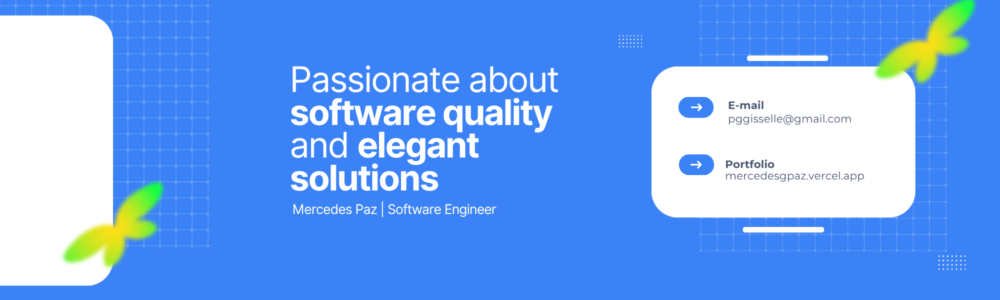

<h1 align="center">Hi there 🌸, I’m Mercedes Paz</h1>

  💻 <strong>Software Engineer</strong> | 🌎 Based in Honduras | 🎨 Creative at heart

I’m passionate about crafting **Full-Stack applications**, with a soft spot for designing **beautiful, user-friendly front-end websites**.  
Outside of coding, you’ll often find me **reading, painting, writing, scrapbooking**, and exploring creative outlets.  
My dream? To use technology to **support mental health and boost productivity** through thoughtful, impactful apps.  

 

## 🌟 What I’m Up To
- 🔭 Currently building my **portfolio** and **digital garden**, alongside several **Full-Stack projects**. Stay tuned!  
- 💬 Deeply interested in **Full-Stack Development** & **Project Management**.  
- ⚡ Fun fact: I’m **23 years old**, love the **Studio Ghibli** films and love reading.  

 

## 🧰 Languages & Tools

  
  

 

## 📩 Contact Me 
📧 pggisselle@gmail.com  
📘 [Let's connect on LinkedIn](https://linkedin.com/in/mercedesgpaz)  
  
Thanks for visiting! Don't be a stranger 🌟
